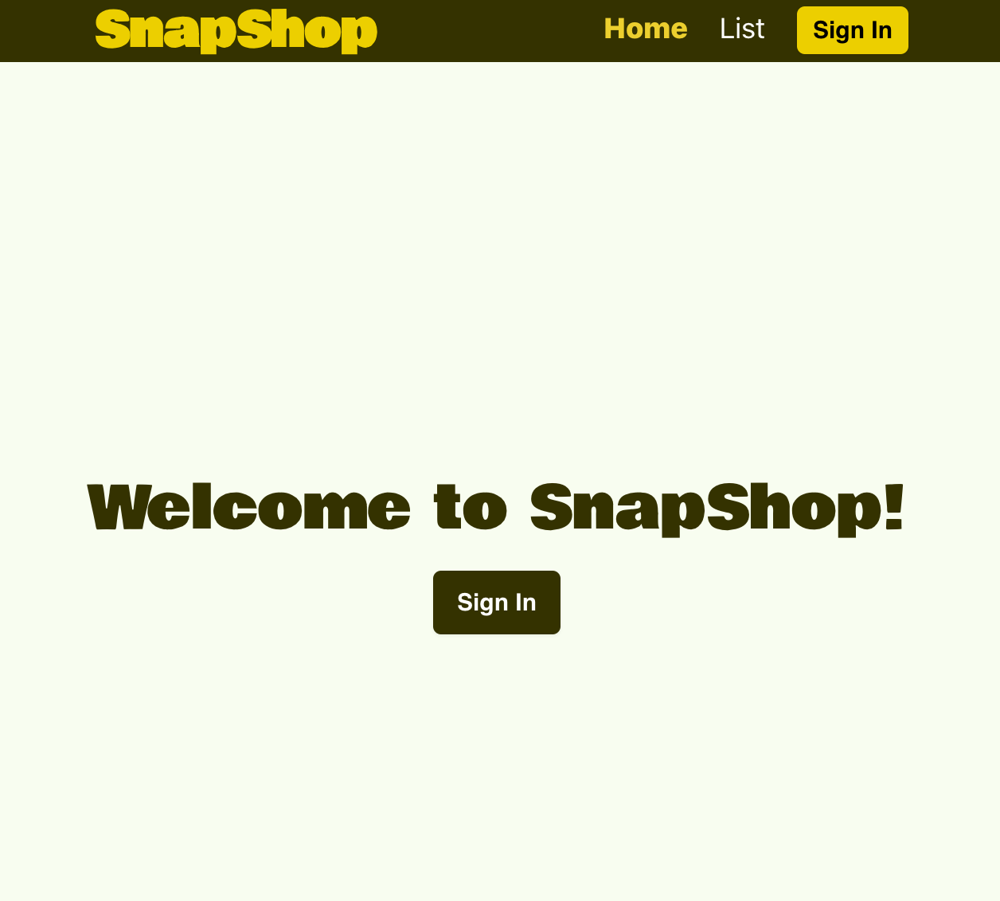
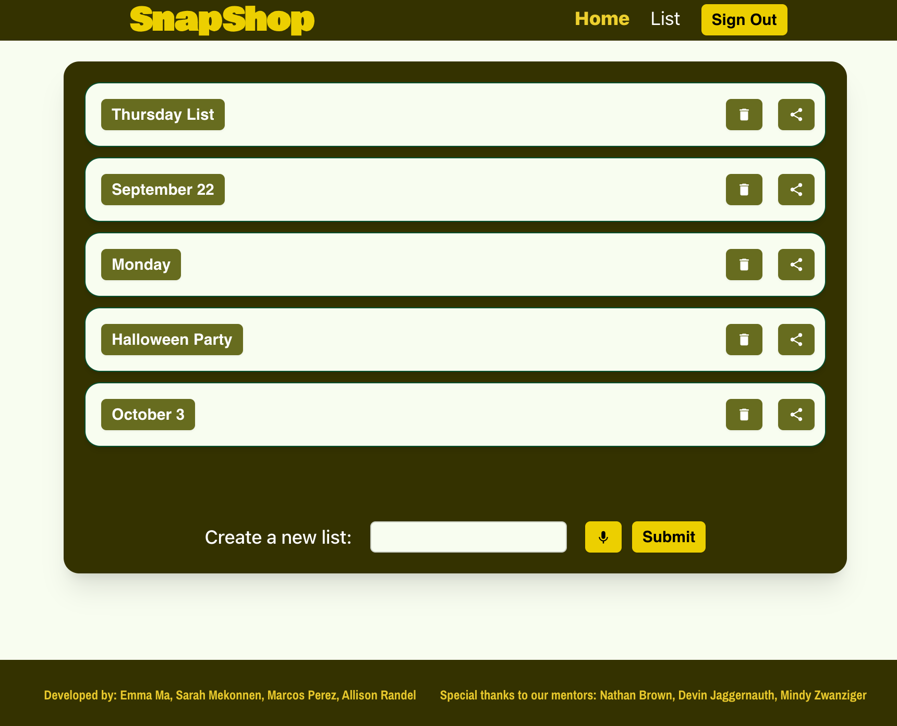
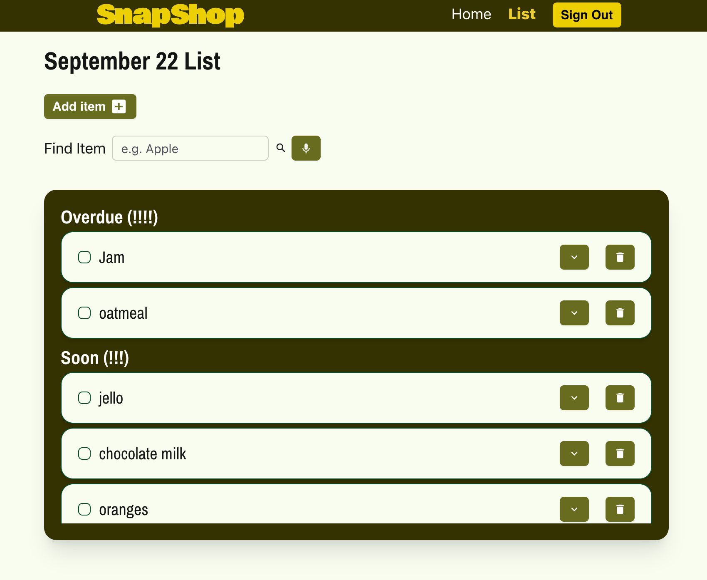
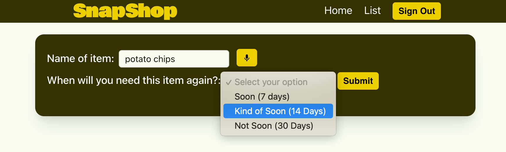
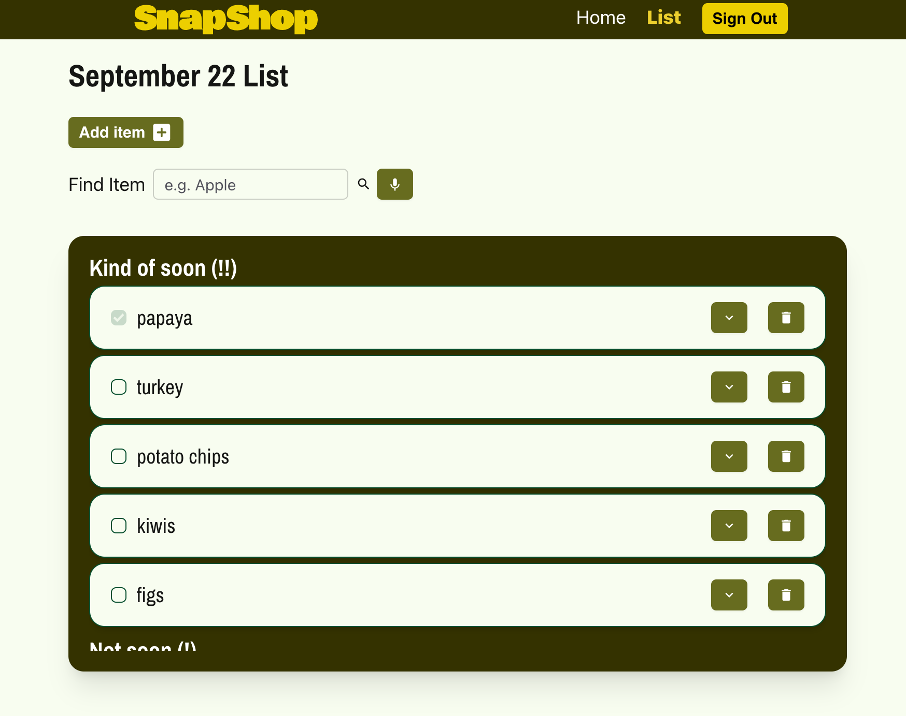
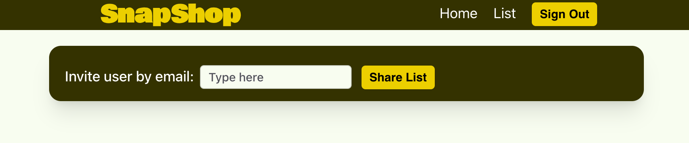

## Overview

This README file explains SnapShop: a smart shopping list application by Emma Ma, Sarah Mekonnen, Marcos Perez, and Allison Randel through The Collab Lab.

The Collab Lab is an online collaboration for developers to exercise coding, technical project management, and peer programming skills.

## What is this project?

The goal of this project is to collaborate with Collab Lab teammates to create a “smart” shopping list app that learns user buying habits and helps remember what users will likely need to buy on their next trip to the store.

## Tech Stack

**Programming languages:** JavaScript, HTML, CSS  
**Front End:** React, TailwindCSS, Daisy UI, Material UI  
**Back End:** Firebase, Node.js  
**Project management:** GitHub, Google Workplace, Miro, Slack  

**Welcome** 

**Home** 

**User's Lists** 

**Adding an Item** 

**Added Item** 

**Share a List** 

## How to use

1. Sign in using a Google email address  
2. Create a list using voice to text or by typing  
3. Select that list, and start adding items  
4. You can add items by clicking “Add Item” and using voice to text or by typing  
5. Select the frequency you expect to buy that item again: Your options are `Soon`, `Kind of Soon`, and `Not Soon`  
6. Click Submit  
7. Go back to your list to see your items  
8. You can go back to the Home page and share your list with a friend by inputting their email address  
9. When a user shares a list with you, you can click into it and check off items  
10. You can also unfollow that list without deleting the list permanently  
11. Your items will move categories as your shopping habits develop and time goes on  
12. When you’re done with a list, you can remove it from your collection  

### Future Plans

- Update alert formatting: make them consistent  
- Ability to rename lists  
- Add items to your list using scan to text  
- Ability to add images to your list  

### Credits

Thank you to our mentors Nathan Brown, Devin Jaggernauth, and Mindy Zwanziger for your constant support throughout our project -- your leadership and wisdom is greatly appreciated!
